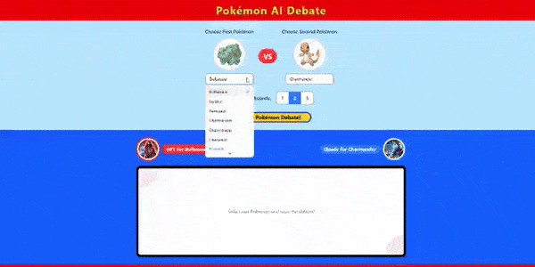

# Pokémon AI Debate

An interactive web application that pits AI against AI in debates about which Pokémon is superior, using OpenAI's GPT, Anthropic's Claude, and Google's Gemini models.



## Overview

Pokémon AI Debate creates entertaining and educational AI-powered debates where:

- GPT argues for one Pokémon
- Claude argues for a different Pokémon
- Gemini acts as an impartial judge to determine the winner

Users can select any of the original 151 Pokémon to debate against each other and watch as the AIs construct arguments and counter-arguments across multiple rounds.

## Features

- **Pokémon Selection**: Choose any of the original 151 Pokémon
- **Real-time Debate**: Watch as AI models debate in real-time
- **Multi-round Format**: Configure debates for 1-3 rounds
- **AI Judge**: Get a final verdict from an "impartial" AI judge
- **Dynamic Visualization**: See Pokémon images and animated battle effects
- **Responsive Design**: Works on desktop and mobile devices

## Technology Stack

### Frontend

- React with TypeScript
- Tailwind CSS for styling
- shadcn/ui component library
- React Query for API requests

### Backend

- Node.js with Express
- AI service integrations:
  - OpenAI API (GPT)
  - Anthropic API (Claude)
  - Google AI API (Gemini)
- Winston for logging

### APIs

- PokéAPI for Pokémon data and images

## Project Structure

```
pokemon-ai-debate/
│
├── client/                  # Frontend React application
│   ├── public/              # Static files
│   ├── src/                 # React source code
│   │   ├── components/      # UI components
│   │   ├── constants/       # Constants like Pokémon list
│   │   └── App.tsx          # Main application
│   └── package.json         # Frontend dependencies
│
├── server/                  # Backend Express server
│   ├── config/              # Configuration files
│   ├── controllers/         # Route handlers
│   ├── services/            # Business logic
│   ├── utils/               # Utility functions
│   ├── middleware/          # Express middleware
│   ├── routes/              # API routes
│   ├── logs/                # Log files (created at runtime)
│   ├── .env                 # Environment variables (not in git)
│   └── server.js            # Entry point
│
├── package.json             # Project dependencies
└── README.md                # This file
```

## Installation

### Prerequisites

- Node.js (v16 or higher)
- npm or yarn
- API keys for OpenAI, Anthropic, and Google AI

### Setup

1. Clone the repository

```bash
git clone https://github.com/tsertic/pokemon-ai-debate.git
cd pokemon-ai-debate
```

2. Install backend dependencies

```bash
cd server
npm install
```

3. Create `.env` file in the server directory with your API keys

```
PORT=3001
NODE_ENV=development
OPENAI_API_KEY=your_openai_key_here
ANTHROPIC_API_KEY=your_anthropic_key_here
GOOGLE_API_KEY=your_google_key_here
```

4. Install frontend dependencies

```bash
cd ../client
npm install
```

5. Create `.env` file in the client directory (for development)

```
VITE_API_URL=http://localhost:3001/api
```

## Running the Application

### Development Mode

Start the backend server:

```bash
cd server
npm run dev
```

In a separate terminal, start the frontend:

```bash
cd client
npm run dev
```

The application will be available at http://localhost:5173 (or another port if 5173 is in use).

### Production Mode

Build the frontend:

```bash
cd client
npm run build
```

Start the backend server in production mode:

```bash
cd ../server
npm start
```

## Usage

1. Select a Pokémon for GPT to defend
2. Select a different Pokémon for Claude to defend
3. Choose the number of debate rounds (1-3)
4. Click "Start Pokémon Debate!"
5. Watch as the AI models debate
6. At the end, view Gemini's verdict and the winner

## Customization

### Adding More Pokémon

Edit the `POKE_LIST.ts` file in the client's constants directory to include more Pokémon.

### Changing AI Prompts

Modify the prompt templates in the server's `ai-config.js` file to change how the AIs approach the debates.

## Contributing

Contributions are welcome! Please feel free to submit a Pull Request.

1. Fork the project
2. Create your feature branch (`git checkout -b feature/amazing-feature`)
3. Commit your changes (`git commit -m 'Add some amazing feature'`)
4. Push to the branch (`git push origin feature/amazing-feature`)
5. Open a Pull Request

## License

MIT

## Acknowledgments

- Pokémon is a trademark of Nintendo/Game Freak
- Special thanks to the creators of the PokéAPI
- Inspired by the fun debates Pokémon fans have had for decades
- Built with AI models from OpenAI, Anthropic, and Google
